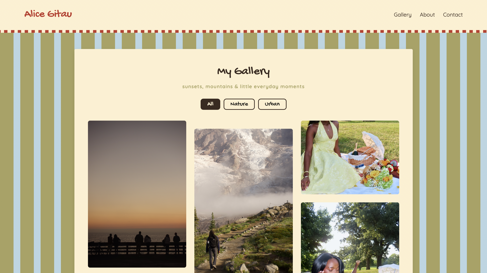
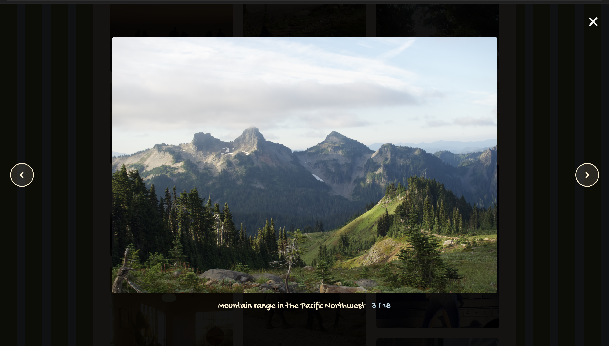
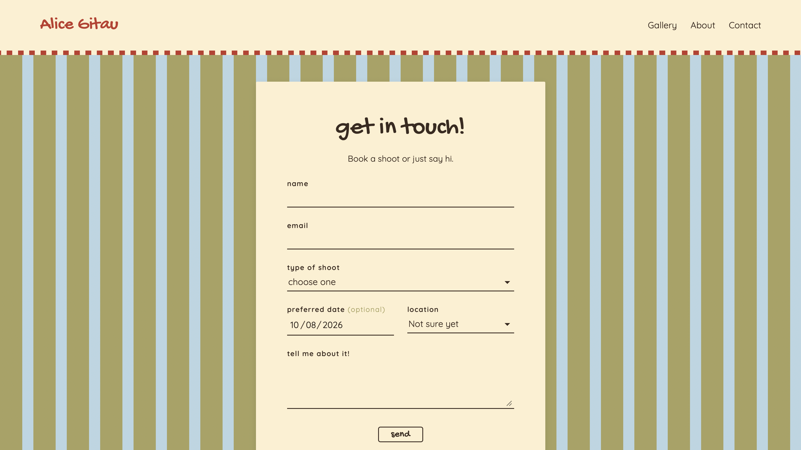
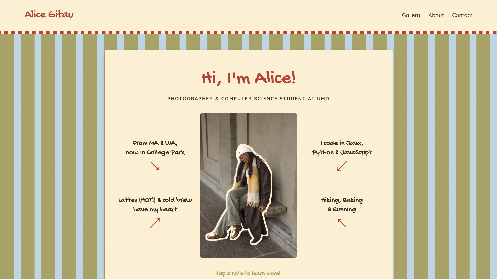
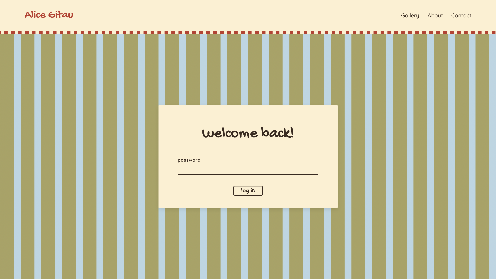

# Alice Gitau Photography

This is my photography portfolio website. It shows my photos, tells people a little about me, and lets people send me a request to book a photo shoot.

I'm a photographer and a computer science student at the University of Maryland. I made this site to share my work and to learn how websites work behind the scenes.

## Screenshots

 
 
 
 
 

---

## What the site does

**For visitors**
- A gallery of my photos that you can filter by **Nature** or **Urban**
- Click a photo to see it full screen, then use the arrows to go to the next one
- An About page with notes about me that you can tap to flip
- A contact page where you can request a shoot (type of shoot, date, location, and a message)
- Works on phones and computers

**For me**
- A private login page
- A page that shows all the booking requests people have sent
- I can mark each request as new, replied, booked, or done so I can keep track of them

---

## What I used

- **HTML, CSS, and JavaScript** for the pages, the design, and the gallery
- **Python with Flask** to run the website and save booking requests
- **SQLite** (a small database) to store the booking requests
- **VS Code** and **GitHub**

---

## How it works (in my own words)

When someone fills out the booking form, the website sends their request to my Python program. The program checks that everything is filled out correctly, then saves it in a database. When I log in, the program pulls the requests out of the database and shows them to me on my bookings page.

The database is only on my computer. It's not uploaded to GitHub, so people's names and emails stay private.

---

## How I built it

This was my first time connecting a website to a database. I built it step by step while learning, using AI help to explain new ideas and fix problems when I got stuck.

---

## What I learned

- How a website's **front end** (what you see) talks to the **back end** (the code running on a server)
- How to save information in a **database** and get it back out
- Why you should **never put passwords in your code**
- How to make a page look good on both **phones and computers**
- How to use **Git and GitHub** to save and share my work

---

## Run it on your computer

You need Python 3 installed.

```bash
git clone https://github.com/gitaualice/Workspace.git
cd Workspace
python3 -m venv .venv
source .venv/bin/activate
pip install -r requirements.txt
export ADMIN_PASSWORD="choose-a-password"
python app.py
```

Then go to **http://127.0.0.1:5000** to see the site, or **http://127.0.0.1:5000/login** to log in.

---

## What I want to add next

- Put the site online so anyone can use it
- Add more photos and categories
- Get an email when someone sends a booking request

---

📧 gitaualice@outlook.com
